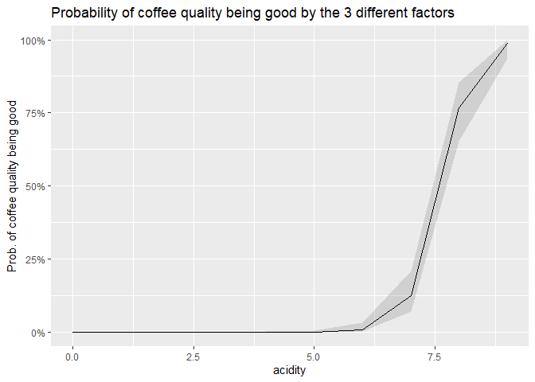

Find the factor of good quality coffee!
================
Group 12

## Introduction

The data set here, is coming from the Coffee Quality Database which is a
database that contains information from the Coffee Quality Institute
which is a non-profit organisation working internationally to improve
the quality of coffee and the lives of the people who produce it. Here,
in this project, we are trying to answer the question “What influence do
different features of coffee have on whether the quality of a batch of
coffee is classified as good or poor?”

For this purpose, firstly, we read the data set.

``` r
coffee_data <- read.csv("dataset12.csv")
```

## Data distribution

#### The Country of origin of the coffee

We take a look at the percentages of good and bad qualities of coffees
with respect to it’s country of origin.

``` r
#Check the percentage of good and poor quality coffee for each country of origin

coffee_data %>% 
  tabyl(country_of_origin, Qualityclass) %>% 
  adorn_percentages() %>% 
  adorn_pct_formatting() %>% 
  adorn_ns()
```

                country_of_origin         Good         Poor
                           Brazil  41.6%  (37)  58.4%  (52)
                          Burundi   0.0%   (0) 100.0%   (1)
                            China  70.0%   (7)  30.0%   (3)
                         Colombia  75.7% (109)  24.3%  (35)
                       Costa Rica  59.0%  (23)  41.0%  (16)
                    Cote d?Ivoire   0.0%   (0) 100.0%   (1)
                          Ecuador  33.3%   (1)  66.7%   (2)
                      El Salvador  75.0%  (12)  25.0%   (4)
                         Ethiopia  90.0%  (27)  10.0%   (3)
                        Guatemala  47.7%  (71)  52.3%  (78)
                            Haiti  16.7%   (1)  83.3%   (5)
                         Honduras  21.1%   (8)  78.9%  (30)
                            India  41.7%   (5)  58.3%   (7)
                        Indonesia  58.8%  (10)  41.2%   (7)
                            Japan 100.0%   (1)   0.0%   (0)
                            Kenya  94.4%  (17)   5.6%   (1)
                             Laos  33.3%   (1)  66.7%   (2)
                           Malawi  10.0%   (1)  90.0%   (9)
                        Mauritius   0.0%   (0) 100.0%   (1)
                           Mexico  26.6%  (50)  73.4% (138)
                          Myanmar   0.0%   (0) 100.0%   (8)
                        Nicaragua  22.7%   (5)  77.3%  (17)
                           Panama  75.0%   (3)  25.0%   (1)
                 Papua New Guinea 100.0%   (1)   0.0%   (0)
                             Peru  75.0%   (3)  25.0%   (1)
                      Philippines  40.0%   (2)  60.0%   (3)
                           Rwanda 100.0%   (1)   0.0%   (0)
                           Taiwan  40.4%  (23)  59.6%  (34)
     Tanzania, United Republic Of  41.9%  (13)  58.1%  (18)
                         Thailand  69.6%  (16)  30.4%   (7)
                           Uganda  75.0%  (21)  25.0%   (7)
                    United States  70.0%   (7)  30.0%   (3)
           United States (Hawaii)  58.5%  (31)  41.5%  (22)
      United States (Puerto Rico)  50.0%   (1)  50.0%   (1)
                          Vietnam  57.1%   (4)  42.9%   (3)

In order to get a clear picture of which countries coffee beans are
mostly of good and bad quality, we can plot the quality based on the
country of origin in gradient scale.

``` r
#Plot the distribution of coffee quality class based on the origin

ggplot(coffee_data, aes(y = Qualityclass)) +
  geom_bar(aes(fill = country_of_origin), position = position_stack(reverse = TRUE)) +
  theme(legend.position = "top")+
  scale_color_gradient(low = "yellow", high = "green")+
  labs(x = "Proportion of Country of Origin", y = "Quality of Coffee")
```

<!-- -->

From the figure above, we can see that the color gradient is larger in
the red area in case of the good quality coffee while that of blue is
dominant in case of bad quality coffee.But the difference is not highly
significant.

### The Aroma of the coffee

Let’s consider the next variable of interest, which is the aroma of the
coffee. Here we want to see how the aroma of the coffee is distributed
around the quality of the coffee.

``` r
#Plot the distribution of coffee quality class based on the aroma
#First plot without rescaling
ggplot(data = coffee_data, aes(x = Qualityclass, y = aroma)) +
  geom_boxplot() +
  labs(title = "Quality score of coffee samples by aroma",
       x = "Aroma",
       y = "Qualityclass")
```

<!-- -->

From the boxplot above, it is hard to get the picture of the
distribution, because of the presence of outliers in this distribution.
So we try to rescale the boxplot to get better visual of the
distribution.

``` r
#Rescaling the plot
ggplot(data = coffee_data, aes(x = Qualityclass, y = aroma)) +
  geom_boxplot() +
  scale_y_continuous(limits = quantile(coffee_data$aroma, c(0.05, 0.95)))+
  labs(title = "Quality score of coffee samples by aroma (Rescale)",
       x = "Quality Class",
       y = "Aroma")
```

<!-- -->

From the boxplot above, we can see that a low value of aroma of the
coffee corresponds to poor quality.

Please note that for the rest of boxplot figure, we use the rescaled
data in order to make the clearer representation of the distribution.

### Flavor

Here, we consider the next variable, flavor of the coffee with respect
to the quality.

``` r
ggplot(data = coffee_data, aes(x = Qualityclass, y = flavor)) +
  geom_boxplot() +
  scale_y_continuous(limits = quantile(coffee_data$flavor, c(0.05, 0.95)))+
  labs(title = "Quality score of coffee samples by flavor (Rescale)",
       x = "Quality Class",
       y = "flavor")
```

<!-- -->

From the boxplot above, we can understand that a coffee is labelled as
good if it has a high flavor grade.

### Acidity

Considering acidity grade with respect to the class of quality.

``` r
ggplot(data = coffee_data, aes(x = Qualityclass, y = acidity)) +
  geom_boxplot() +
  scale_y_continuous(limits = quantile(coffee_data$acidity, c(0.05, 0.95)))+
  labs(title = "Quality score of coffee samples by acidity (Rescale)",
       x = "Quality Class",
       y = "acidity")
```

<!-- -->

We can see that higher the acidity grade, better the coffee quality.

### Category 2 defects

This variable contains the number of times category 2 type defect was
found in the batch of coffee beans tested.

``` r
ggplot(data = coffee_data, aes(x = Qualityclass, y =    category_two_defects)) +
  geom_boxplot() +
  scale_y_continuous(limits =   quantile(coffee_data$category_two_defects, c(0.05, 0.95)))+
  labs(title = "Quality score of coffee samples by category_two_defects (Rescale)",
       x = "Quality Class",
       y = "category_two_defects")
```

<!-- -->

As we can see, category 2 type defects were more in poor quality coffee
beans.And there is no difference mean from the two distribution. For the
futher analysis, we consider to remove this variable.

### Mean altitude of the growers farm

``` r
ggplot(data = coffee_data, aes(x = Qualityclass, y =    altitude_mean_meters)) +
  geom_boxplot() +
  scale_y_continuous(limits =   quantile(coffee_data$altitude_mean_meters, c(0.05, 0.95),na.rm = TRUE))+
  labs(title = "Quality score of coffee samples by altitude_mean_meters (Rescale)",
       x = "Quality Class",
       y = "altitude_mean_meters")
```

-1.png)<!-- -->

From the boxplot, we can analyse that as the mean altitude increases,
the coffee quality also increases.

### Year Harvested

``` r
ggplot(data = coffee_data, aes(x = Qualityclass, group = harvested)) + 
  geom_bar(aes(y = ..prop.., fill = harvested), 
           stat = "count", position = "dodge") + 
  scale_color_gradient(low = "red", high = "green")+
  labs(x = "Quality of Coffee", y = "Proportion")
```

<!-- -->

As can be seen above, the good quality coffee harvested more than poor
quality coffee in total. But there is no significant difference between
them.

In gengeral, we can find that the distributions of country of origin,
year harvested and category of two defect are not significantly
different. But we need to investigate more to decide the final model.

## Formal Analysis

### Using Generalized Linear Model

Model 1: using all the available variables

``` r
coffee_data$binary_response <- ifelse(coffee_data$Qualityclass == "Good", 1, 0)
mod.coffee1 <- glm(binary_response ~ country_of_origin +
                    aroma + flavor + acidity + category_two_defects +
                    altitude_mean_meters + harvested, 
                  data = coffee_data, family = binomial(link = "logit")) 

mod.coffee1 %>%
summary()
```


    Call:
    glm(formula = binary_response ~ country_of_origin + aroma + flavor + 
        acidity + category_two_defects + altitude_mean_meters + harvested, 
        family = binomial(link = "logit"), data = coffee_data)

    Deviance Residuals: 
        Min       1Q   Median       3Q      Max  
    -4.2397  -0.2662  -0.0001   0.2888   3.5768  

    Coefficients:
                                                    Estimate Std. Error z value
    (Intercept)                                   -3.746e+02  1.631e+02  -2.296
    country_of_originBurundi                      -1.254e+01  6.523e+03  -0.002
    country_of_originChina                         8.055e-01  1.067e+00   0.755
    country_of_originColombia                      2.225e+00  5.315e-01   4.185
    country_of_originCosta Rica                    8.782e-01  7.852e-01   1.118
    country_of_originCote d?Ivoire                -1.255e+01  6.523e+03  -0.002
    country_of_originEcuador                      -1.372e+00  1.483e+00  -0.925
    country_of_originEl Salvador                   1.665e+00  1.173e+00   1.419
    country_of_originEthiopia                      1.453e+01  1.070e+03   0.014
    country_of_originGuatemala                    -3.699e-01  4.812e-01  -0.769
    country_of_originHaiti                         2.399e+00  1.789e+00   1.341
    country_of_originHonduras                     -4.493e-01  7.084e-01  -0.634
    country_of_originIndia                        -2.575e+00  9.347e-01  -2.755
    country_of_originIndonesia                     2.340e-01  8.568e-01   0.273
    country_of_originKenya                         5.084e-01  1.599e+00   0.318
    country_of_originLaos                          8.822e-01  1.812e+00   0.487
    country_of_originMalawi                       -5.872e-01  1.222e+00  -0.480
    country_of_originMauritius                    -1.252e+01  6.523e+03  -0.002
    country_of_originMexico                       -5.559e-01  4.996e-01  -1.113
    country_of_originMyanmar                      -1.557e+01  2.066e+03  -0.008
    country_of_originNicaragua                     2.777e-01  1.649e+00   0.168
    country_of_originPanama                        3.330e+00  1.766e+00   1.885
    country_of_originPapua New Guinea              4.444e+00  6.523e+03   0.001
    country_of_originPeru                         -1.375e+01  6.523e+03  -0.002
    country_of_originPhilippines                   2.689e+00  2.511e+00   1.071
    country_of_originRwanda                        1.314e+01  6.523e+03   0.002
    country_of_originTaiwan                       -3.079e-02  6.847e-01  -0.045
    country_of_originTanzania, United Republic Of  1.386e+00  7.079e-01   1.958
    country_of_originThailand                      2.120e+00  8.625e-01   2.458
    country_of_originUganda                       -9.866e-01  7.435e-01  -1.327
    country_of_originUnited States                 3.058e-01  1.422e+00   0.215
    country_of_originUnited States (Hawaii)        7.686e+00  4.218e+03   0.002
    country_of_originUnited States (Puerto Rico)   1.358e+00  8.892e+00   0.153
    country_of_originVietnam                       2.599e+00  1.289e+00   2.017
    aroma                                          4.298e+00  8.199e-01   5.242
    flavor                                         8.833e+00  1.103e+00   8.011
    acidity                                        4.853e+00  8.418e-01   5.765
    category_two_defects                           5.970e-02  3.370e-02   1.771
    altitude_mean_meters                          -1.644e-05  4.932e-05  -0.333
    harvested                                      1.183e-01  8.016e-02   1.476
                                                  Pr(>|z|)    
    (Intercept)                                    0.02165 *  
    country_of_originBurundi                       0.99847    
    country_of_originChina                         0.45045    
    country_of_originColombia                     2.85e-05 ***
    country_of_originCosta Rica                    0.26341    
    country_of_originCote d?Ivoire                 0.99847    
    country_of_originEcuador                       0.35473    
    country_of_originEl Salvador                   0.15592    
    country_of_originEthiopia                      0.98916    
    country_of_originGuatemala                     0.44209    
    country_of_originHaiti                         0.17992    
    country_of_originHonduras                      0.52593    
    country_of_originIndia                         0.00586 ** 
    country_of_originIndonesia                     0.78477    
    country_of_originKenya                         0.75052    
    country_of_originLaos                          0.62637    
    country_of_originMalawi                        0.63094    
    country_of_originMauritius                     0.99847    
    country_of_originMexico                        0.26583    
    country_of_originMyanmar                       0.99399    
    country_of_originNicaragua                     0.86623    
    country_of_originPanama                        0.05939 .  
    country_of_originPapua New Guinea              0.99946    
    country_of_originPeru                          0.99832    
    country_of_originPhilippines                   0.28414    
    country_of_originRwanda                        0.99839    
    country_of_originTaiwan                        0.96414    
    country_of_originTanzania, United Republic Of  0.05025 .  
    country_of_originThailand                      0.01398 *  
    country_of_originUganda                        0.18453    
    country_of_originUnited States                 0.82969    
    country_of_originUnited States (Hawaii)        0.99855    
    country_of_originUnited States (Puerto Rico)   0.87865    
    country_of_originVietnam                       0.04373 *  
    aroma                                         1.58e-07 ***
    flavor                                        1.13e-15 ***
    acidity                                       8.18e-09 ***
    category_two_defects                           0.07654 .  
    altitude_mean_meters                           0.73894    
    harvested                                      0.13991    
    ---
    Signif. codes:  0 '***' 0.001 '**' 0.01 '*' 0.05 '.' 0.1 ' ' 1

    (Dispersion parameter for binomial family taken to be 1)

        Null deviance: 1188.88  on 857  degrees of freedom
    Residual deviance:  426.01  on 818  degrees of freedom
      (174 observations deleted due to missingness)
    AIC: 506.01

    Number of Fisher Scoring iterations: 17

Firstly, we build a model with all variables. However, we can try to
remove insignificant variables to make the model more effective.

Then, we exclude three insignificant variables(country of origin, year
harvested and category of two defect) one by one to build 3 models and
compare them.

Model 2 (excluding **Country of origin**).

``` r
mod.coffee2 <- glm(binary_response ~ aroma + flavor + acidity +  category_two_defects + altitude_mean_meters + harvested, 
                  data = coffee_data, family = binomial(link = "logit")) 
mod.coffee2 %>%
summary()
```


    Call:
    glm(formula = binary_response ~ aroma + flavor + acidity + category_two_defects + 
        altitude_mean_meters + harvested, family = binomial(link = "logit"), 
        data = coffee_data)

    Deviance Residuals: 
        Min       1Q   Median       3Q      Max  
    -4.0193  -0.3517  -0.0028   0.4239   3.2462  

    Coefficients:
                           Estimate Std. Error z value Pr(>|z|)    
    (Intercept)          -1.917e+02  1.229e+02  -1.560    0.119    
    aroma                 4.354e+00  6.994e-01   6.226  4.8e-10 ***
    flavor                7.377e+00  8.840e-01   8.344  < 2e-16 ***
    acidity               3.807e+00  7.025e-01   5.419  6.0e-08 ***
    category_two_defects  1.296e-02  2.638e-02   0.491    0.623    
    altitude_mean_meters -1.281e-05  2.461e-05  -0.521    0.603    
    harvested             3.692e-02  6.063e-02   0.609    0.543    
    ---
    Signif. codes:  0 '***' 0.001 '**' 0.01 '*' 0.05 '.' 0.1 ' ' 1

    (Dispersion parameter for binomial family taken to be 1)

        Null deviance: 1188.88  on 857  degrees of freedom
    Residual deviance:  516.51  on 851  degrees of freedom
      (174 observations deleted due to missingness)
    AIC: 530.51

    Number of Fisher Scoring iterations: 7

Model 3 (excluding **Country of origin** and **category two defect**).

``` r
mod.coffee3 <- glm(binary_response ~ aroma + flavor + acidity +    altitude_mean_meters + harvested, 
                  data = coffee_data, family = binomial(link = "logit")) 
mod.coffee3 %>%
summary()
```


    Call:
    glm(formula = binary_response ~ aroma + flavor + acidity + altitude_mean_meters + 
        harvested, family = binomial(link = "logit"), data = coffee_data)

    Deviance Residuals: 
        Min       1Q   Median       3Q      Max  
    -4.0229  -0.3544  -0.0028   0.4208   3.2322  

    Coefficients:
                           Estimate Std. Error z value Pr(>|z|)    
    (Intercept)          -1.867e+02  1.226e+02  -1.523    0.128    
    aroma                 4.340e+00  6.993e-01   6.206 5.43e-10 ***
    flavor                7.362e+00  8.858e-01   8.311  < 2e-16 ***
    acidity               3.798e+00  7.028e-01   5.404 6.50e-08 ***
    altitude_mean_meters -1.291e-05  2.449e-05  -0.527    0.598    
    harvested             3.457e-02  6.048e-02   0.572    0.568    
    ---
    Signif. codes:  0 '***' 0.001 '**' 0.01 '*' 0.05 '.' 0.1 ' ' 1

    (Dispersion parameter for binomial family taken to be 1)

        Null deviance: 1188.88  on 857  degrees of freedom
    Residual deviance:  516.75  on 852  degrees of freedom
      (174 observations deleted due to missingness)
    AIC: 528.75

    Number of Fisher Scoring iterations: 7

Model 4 (excluding **Country of origin**, **category two defect** and
**year of harvested**)

``` r
mod.coffee4 <- glm(binary_response ~ aroma + flavor + acidity + altitude_mean_meters, 
                  data = coffee_data, family = binomial(link = "logit")) 
mod.coffee4 %>%
summary()
```


    Call:
    glm(formula = binary_response ~ aroma + flavor + acidity + altitude_mean_meters, 
        family = binomial(link = "logit"), data = coffee_data)

    Deviance Residuals: 
        Min       1Q   Median       3Q      Max  
    -4.0163  -0.3547  -0.0017   0.4223   3.2762  

    Coefficients:
                           Estimate Std. Error z value Pr(>|z|)    
    (Intercept)          -1.179e+02  8.609e+00 -13.690  < 2e-16 ***
    aroma                 4.279e+00  6.907e-01   6.195 5.82e-10 ***
    flavor                7.461e+00  8.867e-01   8.414  < 2e-16 ***
    acidity               3.867e+00  7.039e-01   5.493 3.94e-08 ***
    altitude_mean_meters -1.251e-05  2.459e-05  -0.509    0.611    
    ---
    Signif. codes:  0 '***' 0.001 '**' 0.01 '*' 0.05 '.' 0.1 ' ' 1

    (Dispersion parameter for binomial family taken to be 1)

        Null deviance: 1205.70  on 869  degrees of freedom
    Residual deviance:  523.68  on 865  degrees of freedom
      (162 observations deleted due to missingness)
    AIC: 533.68

    Number of Fisher Scoring iterations: 7

### Building the model

From the distribution plot we learn that the distribution of the
**country of origin** are relatively the same between **good and poor
quality coffee**. We also learn that the mean of **Category two defect**
is relatively the same as well for **good and poor quality coffee**. The
same case also appears in the variable year harvested, we can see there
is no significant difference between the distribution of **year
harvested** in the **good and poor quality coffee**.

Hence we conduct 3 different model for this study, they are:

1.  Model 1: Including all variable (i.e the country of origin, aroma,
    flavor, acidity, the count of category two defect, the mean of
    altitude (in meters) and year harvested).

2.  Model 2: Including all variable *except* the country of origin.

3.  Model 3: Including all variable *except* the country of origin and
    the count of category two defect.

4.  Model 4: Including all variable *except* the country of origin, the
    count of category two defect and the year harvested.

### Model Comparison

From the models we try to compare the values in order to decide which
model fits the data better. The summary of model is presented in the
table below:

``` r
model.comp.values.1 <- glance(mod.coffee1)
model.comp.values.2 <- glance(mod.coffee2)
model.comp.values.3 <- glance(mod.coffee3)
model.comp.values.4 <- glance(mod.coffee4)

Models <- c('Model 1','Model 2','Model 3', 'Model 4') 
bind_rows(model.comp.values.1, model.comp.values.2,
          model.comp.values.3,model.comp.values.4,.id="Model") %>%
  mutate(Model=Models) %>%  
  kable(
     digits = 2,
     caption = "Model comparison values for different models" 
  )
```

| Model   | null.deviance | df.null |  logLik |    AIC |    BIC | deviance | df.residual | nobs |
|:--------|--------------:|--------:|--------:|-------:|-------:|---------:|------------:|-----:|
| Model 1 |       1188.88 |     857 | -213.01 | 506.01 | 696.19 |   426.01 |         818 |  858 |
| Model 2 |       1188.88 |     857 | -258.25 | 530.51 | 563.79 |   516.51 |         851 |  858 |
| Model 3 |       1188.88 |     857 | -258.38 | 528.75 | 557.28 |   516.75 |         852 |  858 |
| Model 4 |       1205.70 |     869 | -261.84 | 533.68 | 557.52 |   523.68 |         865 |  870 |

Model comparison values for different models

To choose the best fit for our model, we choose the model with low AIC,
BIC and large deviance. From the table above, we can see that model 1
has the highest BIC, so model 3 is the best fit compared to the erst.

Now, lets look at the summary of model 3:

``` r
#Presenting summary model 3
summ(mod.coffee3)
```

<table class="table table-striped table-hover table-condensed table-responsive" style="width: auto !important; margin-left: auto; margin-right: auto;">
<tbody>
<tr>
<td style="text-align:left;font-weight: bold;">
Observations
</td>
<td style="text-align:right;">
858 (174 missing obs. deleted)
</td>
</tr>
<tr>
<td style="text-align:left;font-weight: bold;">
Dependent variable
</td>
<td style="text-align:right;">
binary_response
</td>
</tr>
<tr>
<td style="text-align:left;font-weight: bold;">
Type
</td>
<td style="text-align:right;">
Generalized linear model
</td>
</tr>
<tr>
<td style="text-align:left;font-weight: bold;">
Family
</td>
<td style="text-align:right;">
binomial
</td>
</tr>
<tr>
<td style="text-align:left;font-weight: bold;">
Link
</td>
<td style="text-align:right;">
logit
</td>
</tr>
</tbody>
</table>
<table class="table table-striped table-hover table-condensed table-responsive" style="width: auto !important; margin-left: auto; margin-right: auto;">
<tbody>
<tr>
<td style="text-align:left;font-weight: bold;">
χ²(5)
</td>
<td style="text-align:right;">
672.13
</td>
</tr>
<tr>
<td style="text-align:left;font-weight: bold;">
Pseudo-R² (Cragg-Uhler)
</td>
<td style="text-align:right;">
0.72
</td>
</tr>
<tr>
<td style="text-align:left;font-weight: bold;">
Pseudo-R² (McFadden)
</td>
<td style="text-align:right;">
0.57
</td>
</tr>
<tr>
<td style="text-align:left;font-weight: bold;">
AIC
</td>
<td style="text-align:right;">
528.75
</td>
</tr>
<tr>
<td style="text-align:left;font-weight: bold;">
BIC
</td>
<td style="text-align:right;">
557.28
</td>
</tr>
</tbody>
</table>
<table class="table table-striped table-hover table-condensed table-responsive" style="width: auto !important; margin-left: auto; margin-right: auto;border-bottom: 0;">
<thead>
<tr>
<th style="text-align:left;">
</th>
<th style="text-align:right;">
Est.
</th>
<th style="text-align:right;">
S.E.
</th>
<th style="text-align:right;">
z val.
</th>
<th style="text-align:right;">
p
</th>
</tr>
</thead>
<tbody>
<tr>
<td style="text-align:left;font-weight: bold;">
(Intercept)
</td>
<td style="text-align:right;">
-186.69
</td>
<td style="text-align:right;">
122.57
</td>
<td style="text-align:right;">
-1.52
</td>
<td style="text-align:right;">
0.13
</td>
</tr>
<tr>
<td style="text-align:left;font-weight: bold;">
aroma
</td>
<td style="text-align:right;">
4.34
</td>
<td style="text-align:right;">
0.70
</td>
<td style="text-align:right;">
6.21
</td>
<td style="text-align:right;">
0.00
</td>
</tr>
<tr>
<td style="text-align:left;font-weight: bold;">
flavor
</td>
<td style="text-align:right;">
7.36
</td>
<td style="text-align:right;">
0.89
</td>
<td style="text-align:right;">
8.31
</td>
<td style="text-align:right;">
0.00
</td>
</tr>
<tr>
<td style="text-align:left;font-weight: bold;">
acidity
</td>
<td style="text-align:right;">
3.80
</td>
<td style="text-align:right;">
0.70
</td>
<td style="text-align:right;">
5.40
</td>
<td style="text-align:right;">
0.00
</td>
</tr>
<tr>
<td style="text-align:left;font-weight: bold;">
altitude_mean_meters
</td>
<td style="text-align:right;">
-0.00
</td>
<td style="text-align:right;">
0.00
</td>
<td style="text-align:right;">
-0.53
</td>
<td style="text-align:right;">
0.60
</td>
</tr>
<tr>
<td style="text-align:left;font-weight: bold;">
harvested
</td>
<td style="text-align:right;">
0.03
</td>
<td style="text-align:right;">
0.06
</td>
<td style="text-align:right;">
0.57
</td>
<td style="text-align:right;">
0.57
</td>
</tr>
</tbody>
<tfoot>
<tr>
<td style="padding: 0; " colspan="100%">
<sup></sup> Standard errors: MLE
</td>
</tr>
</tfoot>
</table>

Now, lets take a look at the confidence intervals of the explanatory
variables:

``` r
confint(mod.coffee3)%>%
  kable()
```

|                      |        2.5 % |     97.5 % |
|:---------------------|-------------:|-----------:|
| (Intercept)          | -428.4069319 | 52.9609778 |
| aroma                |    3.0073170 |  5.7519824 |
| flavor               |    5.6896853 |  9.1674956 |
| acidity              |    2.4446104 |  5.2039950 |
| altitude_mean_meters |           NA |  0.0000106 |
| harvested            |   -0.0841084 |  0.1534155 |

We can see the p values for **altitude_mean_meters** and **harvested**
are 0.60 and 0.57 respectively, both are large than 0.05. The confident
intervals for these two variables also contain zero. That means, they
are not significant. So, we drop the variables **altitude_mean_meters**
and **harvested**.

### Model summary

The final model contains three explanatory variables aroma, flavor and
acidity.

We then check the summary of this **final model**:

``` r
mod.final <- glm(binary_response ~ aroma + flavor + acidity, 
                  data = coffee_data, family = binomial(link = "logit")) 
mod.final %>%
summary()
```


    Call:
    glm(formula = binary_response ~ aroma + flavor + acidity, family = binomial(link = "logit"), 
        data = coffee_data)

    Deviance Residuals: 
        Min       1Q   Median       3Q      Max  
    -3.8573  -0.3830  -0.0009   0.4439   3.1492  

    Coefficients:
                 Estimate Std. Error z value Pr(>|z|)    
    (Intercept) -110.2817     7.3137 -15.079  < 2e-16 ***
    aroma          4.3012     0.6073   7.082 1.42e-12 ***
    flavor         7.1453     0.7580   9.426  < 2e-16 ***
    acidity        3.1558     0.5716   5.521 3.37e-08 ***
    ---
    Signif. codes:  0 '***' 0.001 '**' 0.01 '*' 0.05 '.' 0.1 ' ' 1

    (Dispersion parameter for binomial family taken to be 1)

        Null deviance: 1430.59  on 1031  degrees of freedom
    Residual deviance:  642.46  on 1028  degrees of freedom
    AIC: 650.46

    Number of Fisher Scoring iterations: 7

We can see that all the variables are significant and the AIC value is
650.46

### Log odds plot

Finally, we look at the plot of the log odds of our final model:

``` r
#plotting log odds
plot_model(mod.final, show.values = TRUE, transform = NULL,
           title = "Log-Odds", show.p = FALSE)
```

<!-- -->

We interpret the odds ratios as follows:

- for each unit increase in the aroma grade of the coffee, their odds of
  being good quality coffee increases (by a factor of 4.30),

- for each unit increase in the flavor grade of the coffee, the odds of
  it being good quality coffee increases (by a factor of 7.15),

- the more acidic the coffee, their odds of being good quality coffee
  increases (by a factor of 3.16)

### Probability of the coffee being good quality by 3 factors:

``` r
plot_model(mod.final, type = "pred", title = "Probability of coffee quality being good by the 3 different factors",
            axis.title = c(mod.final$colnumes,"Prob. of coffee quality being good")) 
```

    $aroma

<!-- -->


    $flavor

<!-- -->


    $acidity

<!-- -->

As can be seen above, the coffee will become better if aroma, flavor and
acidity become better. The three probability curves are similar, all
rising steadily and then rising sharply around 6.
